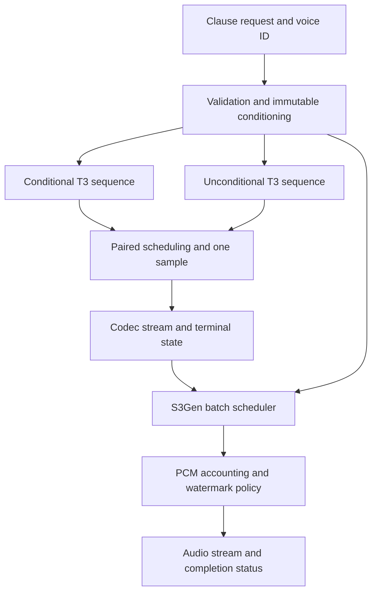

# Chatterbox Multilingual V3 on vLLM-Omni

## 1. Engineering decision

A native vLLM-Omni port is feasible. Build it as a dedicated **Chatterbox Multilingual V3** model with a continuously batched T3 autoregressive stage and a separately scheduled S3Gen acoustic stage. Start with complete text clauses, preserve the official model’s inference behavior, and qualify incremental audio generation separately. English and Arabic are supported language inputs; reliable English–Arabic code switching still needs its own evaluation.

This is substantial inference engineering. It is more than adding an HTTP server around `generate()`, and the available Chatterbox pull request does not provide a verified multilingual V3 implementation. The hardest work is preserving classifier-free guidance under scheduling, keeping speaker conditioning isolated across users, and making the acoustic decoder stream without unacceptable quality changes. The repository state assessed here is pinned to 8 September 2026. [1][S1] [2][S2] [3][S3]

**Do not promise zero hallucinations or 100% linguistic accuracy.** A correct port can preserve the original model’s behavior and eliminate identified implementation faults. It cannot prove that a generative speech model will never omit, repeat, mispronounce, or invent speech. Use explicit model-fidelity, audio-integrity, language-quality, and serving-reliability gates. A successful test suite is evidence about its tested conditions, not a universal accuracy guarantee.

The recommended release sequence is:

1. A faithful, complete-clause, nonstreaming V3 implementation.
2. Concurrent serving with strict CFG pairing and isolated conditioning.
3. Streaming transport of completed audio with exact sample accounting.
4. Incremental acoustic decoding only after a prefix-stability and listening evaluation.
5. Performance optimization, then Saudi Arabic fine-tuning against the frozen serving baseline.

The accompanying handoff contains executable reference algorithms and 28 CPU tests. It does **not** contain a completed or GPU-validated Omni model. Native integration code below is an implementation specification; GPU fidelity, real audio, streaming quality, and throughput remain release gates.

## 2. Freeze the exact model and runtime

### 2.1 Revision manifest

| Component | Audited revision | Treatment |
|---|---|---|
| Official `resemble-ai/chatterbox` | `5de7a54aa4e5e2baadb0182dde554908b48b85c2` | Reference inference and architecture |
| Hugging Face `ResembleAI/chatterbox` | `5bb1f6ee58e50c3b8d408bc82a6d3740c2db6e18` | Immutable model snapshot |
| `vllm-project/vllm-omni` main | `b3dd45874a750f7edfa39bb02262804228e5ff7b` | Target integration interfaces |
| vLLM core | `v0.28.0` | Target core API; record resolved commit/package hash in the build lock |
| Chatterbox PR #3004 head | `21b6b2e5b590a258635354838e956322d71df760` | Reference implementation to inspect selectively |
| Community `randombk/chatterbox-vllm` | `8630314597985f085806983a5319247d1e067e9b` | Historical prototype, not a production V3 baseline |

The open PR and current main are different codebases. PR #3004 uses older deployment and serving interfaces. Current Omni provides `PipelineConfig`, dedicated TTS adapters, and reusable CFG scheduling support. Adapt to the pinned current interfaces; do not copy old integration glue unchanged. [2][S2] [4][S4] [5][S5] [6][S6]

The upstream Chatterbox dependency pins and current Omni dependency requirements differ, including Transformers. Use two reproducible environments: an official reference runner and the target Omni runner. Do not install `chatterbox-tts` with dependency resolution into the Omni environment and let it replace the engine’s Torch or Transformers. Selectively vendor the required model components, retaining their license notices, or install an audited dependency-isolated package. Freeze the GPU-specific Torch/CUDA stack when hardware is selected. [7][S7] [8][S8]

### 2.2 A significant V3 checkpoint ambiguity

At the pinned upstream source revision, omitting `t3_model` still selects **V2**. Explicit `t3_model="v3"` selects `t3_mtl23ls_v3.safetensors`, but the official loader still loads **`s3gen.pt`**, even though the model repository contains `s3gen_v3.pt` and `s3gen_v3.safetensors`. File names alone do not establish the intended end-to-end V3 pairing. [1][S1] [9][S9]

Define two separate profiles:

| Profile | T3 | S3Gen | Qualification |
|---|---|---|---|
| `official_loader_v3` | `t3_mtl23ls_v3.safetensors` | `s3gen.pt` | Primary reference: matches the pinned official loader |
| `candidate_s3gen_v3` | Same V3 T3 | Explicit V3 S3Gen checkpoint | Separate candidate; strict state-dict loading and independent audio qualification |

Do not switch between these profiles through a fallback. Record the acoustic checkpoint in every model manifest and benchmark. Clarification from the maintainers would resolve intended packaging, but it is not necessary to implement and measure the exact official-loader profile.

The handoff’s `manifest.json` includes the following model file hashes, obtained from the pinned Hugging Face file metadata; the tokenizer hash was computed from its downloaded bytes. The large weight payloads were not downloaded or executed for this report. Verify hashes locally before running them.

| File | SHA-256 |
|---|---|
| `t3_mtl23ls_v3.safetensors` | `5abca8321ede76f8e61f1cc0d19aea6c946b28871017ce8726f8a69203f05953` |
| `s3gen.pt` | `9b9ff07e60b20c136e2b1b3d7563a24604e8d2c4c267888d1ee929dd0151d2a3` |
| `s3gen_v3.pt` | `f7abce4b196dae2d08d9296cbebc6521b046079577643b42a19a03499d08721e` |
| `s3gen_v3.safetensors` | `4a46190f3dccc2230fbb3488a930bccc925862ee68f2662433dfcfe93ce6c2cb` |
| `ve.pt` | `4b16d836bc598509860f6fa068165a8bb5e9ac84f05582dfcf278a5a372879f1` |
| `grapheme_mtl_merged_expanded_v1.json` | `69632f47220a788a52ce2661d096453c5655e9bf25289d89a8d832c46ee07dbf` |

Use a fixed, explicitly supplied reference voice for initial parity experiments. If builtin `conds.pt` is later supported, add its hash to the manifest and qualify it too. Never silently substitute a default voice when a requested voice fails to load.

### 2.3 Loading and conversion rules

Read the safetensors header before allocation. The inspected V3 header contains 293 tensor entries and F32 weights, including `text_emb.weight` of shape `[2454,1024]` and `speech_head.weight` of shape `[8194,1024]`. A `torch_dtype="bfloat16"` value in a configuration does not prove that the official instantiated model ran in BF16. Record actual parameter and activation dtypes in the reference runner. [9][S9] [10][S10]

Create an inference export with `config.json`, the original tokenizer, a model manifest, and explicit weight mapping. Preserve the original checkpoint alongside the export. Validate every required parameter; allow only a documented inference-unused list, such as `text_head`, rather than accepting arbitrary missing or unexpected weights. Load `.pt` artifacts with the appropriate restricted weights-only loader. Model identity includes the exporter version and preprocessing version as well as weight hashes.

## 3. Architecture and exact inference behavior

### 3.1 T3: text and conditioning to speech tokens

| Property | Multilingual V3 value |
|---|---|
| Backbone | Custom Llama, approximately 520M class |
| Layers / hidden / MLP | 30 / 1024 / 4096 |
| Attention heads / KV heads / head dimension | 16 / 16 / 64 |
| Activation / RMS epsilon | SiLU / `1e-5` |
| RoPE | Theta `500000`, Llama 3 scaling factor `8`, low frequency factor `1`, high frequency factor `4`, original context `8192` |
| Text vocabulary | 2454; text start `255`, stop `0` |
| Speech output head | 8194 logits |
| Acoustic codec IDs | `0..6560`; speech BOS `6561`; EOS `6562` |
| Speech rate | 25 codec tokens per second |
| Learned position tables | Text `[2050,1024]`; speech `[4100,1024]` |
| Public wrapper generation cap | 1000 new speech-generation steps |
| Typical conditioning prefix | Speaker projection + 32 Perceiver outputs + exaggeration projection = 34 positions |

These properties come from the multilingual T3 configuration, Llama configuration, conditioning modules, and checkpoint header. The backbone’s nominal `max_position_embeddings=131072` is not permission to accept a 131k-token TTS prompt: the learned text and speech position tables impose much smaller constraints. Calculate valid lengths from the actual conditioning and tokenizer output. [10][S10] [11][S11] [12][S12]

The backbone’s configured vocabulary of eight is an unused placeholder because Chatterbox supplies its own input embeddings and speech head. The engine must understand the real speech output vocabulary. Do not send generated codec IDs through the backbone’s eight-entry token embedding. Either maintain a separate backbone config and speech-output config, or document an inference-safe replacement of the unused embedding table. In either case, all model forwards must receive the correct custom embeddings.

### 3.2 Reference voice processing

The wrapper loads mono audio at 24 kHz, derives a 16 kHz version, uses the first ten seconds for S3Gen reference conditioning, and uses the first six seconds for up to 150 T3 prompt codec tokens. The T3 voice encoder receives the resampled reference rather than the ten-second cropped S3Gen reference. The speech prompt tokens must come from the tokenizer associated with the loaded S3Gen checkpoint. [1][S1]

Maintain the distinct roles of the T3 speaker embedding and the S3Gen speaker/reference features. They are not interchangeable vectors. T3’s 256-dimensional speaker embedding is projected to 1024 dimensions. Its prompt codec embeddings receive learned speech positions before the Perceiver. Recompute derived conditioning whenever an updated checkpoint changes those embedding or conditioning weights. [12][S12]

The official wrapper mutates `self.conds`, including exaggeration changes. T3 also caches derived conditioning embeddings on mutable objects. A shared instance called concurrently through asynchronous HTTP handlers is therefore not an isolation design. Cache immutable artifacts and create request-owned views/state; do not mutate the active speaker or exaggeration on a global model.

### 3.3 The exact prefill sequence matters

Let `C` be the conditioning embeddings, and let `T` include text start, the language marker and normalized text tokens, and text stop. At the pinned revision, `prepare_input_embeds()` includes a speech BOS embedding. The explicit `inference()` loop appends another BOS embedding. Both receive local learned speech position zero. [13][S13]

```text
prefill = concat(
    C,
    text_embedding(T) + text_position(0 .. len(T)-1),
    speech_embedding(BOS) + speech_position(0),
    speech_embedding(BOS) + speech_position(0),
)
```

Keep this duplicate BOS in the faithful baseline. Removing it because it looks redundant changes the model’s input. The engine’s global RoPE positions advance across the entire concatenation; learned text and speech positions are additional local position systems.

After prefill, the first sampled token is fed back with learned speech position one, the next with position two, and so on. Derive this index from the request’s generated speech count. Never use a batch-wide counter or the global transformer position as the learned speech position. The provided `build_t3_prefix()` and `speech_decode_embedding()` functions make these contracts executable.

### 3.4 Classifier-free guidance

For normal positive CFG weight, the conditional and unconditional rows share speaker conditioning, speech history, sequence length, and position indices. The unconditional row zeroes text **content embeddings**, then adds the same learned text positions. It is not an empty-text request. [13][S13]

The official blend is:

\[
g = l_c + w(l_c-l_u).
\]

Omni’s Audex implementation uses:

\[
g = l_u + s(l_c-l_u).
\]

Therefore `s = 1 + w`; the default Chatterbox `cfg_weight=0.5` maps to **`cfg_scale=1.5`**. Each logical request generally consumes two KV sequences. Both rows must receive the same sampled speech token at every step. Identical logits alone do not ensure identical independent random samples. [14][S14]

At `cfg_weight=0`, the pinned reference does not zero the second row’s text, but the blend depends only on the conditional row. Qualify a single-row optimization separately; it is not the default production quality profile.

### 3.5 Sampling order and termination

The wrapper defaults are temperature `0.8`, repetition penalty `1.2`, `min_p=0.05`, `top_p=1.0`, and CFG weight `0.5`. There is no top-k truncation in this path. The repetition history starts with speech BOS and includes generated speech tokens, excluding reference prompt codes, text tokens, and engine placeholder IDs. [1][S1] [13][S13]

The faithful ordering is:

1. Combine conditional and unconditional raw logits.
2. Apply the repetition penalty to the speech history.
3. Divide by temperature.
4. Apply min-p filtering.
5. Apply top-p filtering.
6. Sample once and synchronize the paired sequences.
7. Stop on speech EOS; otherwise feed the sampled token with its learned speech position.

The original loop does not hard-mask every non-codec output class. A production policy that permits only `0..6560` plus EOS is reasonable to evaluate, but it changes the distribution. Keep separate `reference` and `hardened` policies and compare them. `drop_invalid_tokens()` is not a complete validator for arbitrary negative or out-of-range IDs. [15][S15]

Do not apply a `-inf` allowed-token mask independently to both CFG branches before the subtraction: `-inf - -inf` produces NaN. Compute finite CFG first, then apply a legal-domain mask. Reject nonfinite raw logits rather than concealing them.

The explicit reference loop does not use several generic generation arguments in the way their names suggest. In particular, do not assume `do_sample=False` provides a ready-made reference greedy mode; instrument a diagnostic deterministic-token runner explicitly. Temperature zero is not a valid shortcut for the reference division-based loop.

### 3.6 S3Gen: tokens to waveform

S3Gen contains a token-to-mel model with conditional flow matching and a HiFT vocoder. The standard constructor uses `meanflow=False`; its normal path runs ten flow steps. Acoustic CFG is independent of T3’s AR CFG. The model produces 24 kHz audio at approximately 960 samples per 25 Hz codec token, with two mel frames per token. [16][S16] [17][S17] [18][S18]

Do not copy Turbo’s distilled one/two-step assumptions into this model. Changing the number of solver steps, noise schedule, acoustic CFG, or vocoder implementation is a model-quality change that requires measurement. Moving the same acoustic network into another runtime does not by itself remove its iterative cost.

The wrapper truncates the final decoded waveform to `max(1, N-1) * 960` samples for `N` valid speech codes and then applies Perth watermarking. The acoustic inference also applies its initial fade behavior. Preserve these in the reference endpoint. For streaming, apply the initial fade once, reserve the final trim, and qualify how watermarking interacts with chunks. Do not add PR-specific silence padding to the faithful baseline. [1][S1] [16][S16]

## 4. What the existing Omni Chatterbox work actually provides

At the audited revision there is no Chatterbox model registered in merged Omni main. PR #3004 is open. It targets Turbo and an Original preview, with separate GPT-2 and Llama branches. Its Original branch loads the English tokenizer/checkpoint and explicitly lacks the AR CFG behavior required here. PR #1517 is a closed, unmerged predecessor. [2][S2] [3][S3] [19][S19]

The title’s “production” wording is not independent validation. The PR’s example timings include boot and a few English outputs; they do not establish warmed latency, multilingual fidelity, streaming continuity, or concurrent capacity. A reported intermediate WER of roughly 0.25 versus a native baseline around 0.08 is a remaining gap, even if described optimistically in discussion. [2][S2]

| Area | Source observation | Required action | Priority |
|---|---|---|---|
| Checkpoint selection | Original path uses English `t3_cfg.safetensors` and `EnTokenizer` | Add an explicit multilingual V3 architecture and manifest-driven loader | Blocking |
| CFG | Original preview omits paired AR CFG | Integrate current Omni pair mechanisms and strict failure policy | Blocking |
| RoPE | Llama construction supplies theta but omits the official scaling dictionary | Preserve complete RoPE configuration and verify fixed-history logits | Blocking |
| Prefill | Original prompt builder has one BOS | Match the pinned V3 reference’s two-BOS sequence | Blocking |
| Acoustic batch conditioning | `_get_ref_dict` warns about mixed references and uses the first reference across the batch | Implement per-row reference conditioning or separate such batches | Blocking |
| Reference tokenizer | PR contains a fix to load fine-tuned tokenizer weights, with fallback behavior | Require the correct tokenizer and fail startup if unavailable | Blocking |
| Token validation | Filtering based only on `<6561` does not reject negatives | Validate the entire codec domain and EOS contract | Blocking |
| Chunking | Fixed windowing, silence padding, and crossfade change acoustic context | Qualify streaming against the full-clause baseline | Blocking for incremental mode |
| Reference cache | Path-based identity can survive content replacement | Key by decoded content and model/preprocessor versions | Blocking for voice correctness |
| Serving/configuration | Older stage configuration and shared serving edits | Use current pipeline registry and TTS adapter interfaces | Required |
| Sampling defaults | Turbo-style top-k/top-p are not multilingual wrapper defaults | Explicit multilingual sampling profile | Required |
| Cleanup | Wave tails are cached; cleanup must be tied to lifecycle | Add cancellation, terminal, timeout, and worker-failure cleanup | Required |

These findings come from source inspection, not a GPU reproduction. The mixed-reference fallback is explicit in the implementation. Potential duplicate final chunks at exact token boundaries should be treated as a concrete regression case to reproduce, not a claimed measured incident. The handoff supplies monotonic cursor tests to prevent that class of failure. [20][S20] [21][S21] [22][S22]

Reuse the PR’s weight-mapping ideas, custom embedding integration pattern, and acoustic stage packaging where they match the target. Keep the native multilingual tokenizer and exact conditioning modules. Do not merge its whole branch and call the result a V3 port.

One correction to older community guidance: the pinned official V3 execution path does **not** contain an Alignment Stream Analyzer or request attention outputs. The historical warning about a prototype omitting alignment heuristics should not be turned into an instruction to “restore” an unverified current V3 feature. A new alignment monitor would be an additional feature, with its own latency and quality assessment. [13][S13] [23][S23] [6][S6]

## 5. Target engine architecture



The server accepts a complete clause before starting T3. It may stream audio while that clause is being synthesized, once the incremental acoustic mode passes qualification. This scope avoids the additional problem of changing the text context during a single T3 request.

Use two native Omni stages:

| Stage | Execution type | Responsibility |
|---|---|---|
| T3 | `StageExecutionType.LLM_AR` | Custom prefill embeddings, paged KV, CFG pair scheduling, speech sampling |
| S3Gen | `StageExecutionType.LLM_GENERATION` | Non-AR token-to-wave computation under the generation worker, reference-aware batching, audio output |

CosyVoice3 is a useful current integration reference because it also separates AR generation from flow-based token-to-wave conversion. It is not a source of Chatterbox-specific sampling settings, chunk sizes, reference packing, or solver steps. [4][S4] [24][S24]

Run one model replica per worker process and use request-scoped state. Co-locating stages on a GPU can be an initial deployment option, but profile their contention. Separate GPU pools can improve predictability if acoustic bursts interfere with T3 decode. No hardware-independent choice guarantees the best latency.

### 5.1 Current native integration points

| Target file or interface | Work |
|---|---|
| `vllm_omni/transformers_utils/configs/chatterbox_mtl_v3.py` | New config: exact architecture, checkpoint profile, text/speech vocabularies, sample rate, model hashes |
| `vllm_omni/model_executor/models/chatterbox_mtl_v3/t3.py` | Custom Llama wrapper, embeddings, speech head, weight loading, request-aware pre/postprocessing |
| Same directory, `conditioning.py` | Immutable reference preprocessing and conditioning cache |
| Same directory, `sampling.py` | V1 CFG processor plus speech-only repetition policy |
| Same directory, `s3gen.py` | Exact acoustic modules, explicit RNG inputs, batch separation/packing, audio results |
| Same directory, `streaming.py` | Codec cursor, acoustic context policy, sample ledger, terminal cleanup |
| Same directory, `pipeline.py` | Frozen two-stage `PipelineConfig` |
| `model_executor/stage_input_processors/chatterbox_mtl_v3.py` | Full-payload conversion, async codec transfer, CFG prompt expansion |
| `entrypoints/openai/tts_adapters/chatterbox_mtl_v3.py` | API normalization, capabilities, sampling overrides, output validation |
| `config/pipeline_registry.py` | Register model type and pipeline |
| `model_executor/models/registry.py` | Register model classes |
| `entrypoints/openai/tts_adapters/__init__.py` | Import adapter so it registers |
| `transformers_utils` config registration | Register the new config following current native models |
| `deploy/chatterbox_mtl_v3.yaml` | Deployment profile using current `stages` structure |
| Tests under model, worker, connector, and serving suites | Fidelity, scheduler, transport, cancellation, and isolation tests |

Do not modify Qwen’s adapter to masquerade as Chatterbox. The base TTS adapter’s default supported-language list excludes Arabic; explicitly expose and normalize `ar`/`Arabic` and `en`/`English`. Mixed-language handling is a policy implemented in this adapter or a clause frontend, not an undocumented model language token. [5][S5]

### 5.2 Pipeline implementation blueprint

The following expresses the current topology API. It becomes functional only after the referenced model classes and processor functions are implemented and registered. It is not an already-installed Chatterbox pipeline.

```python
from vllm_omni.config.stage_config import (
    PipelineConfig, StageExecutionType, StagePipelineConfig,
)

P = "vllm_omni.model_executor.stage_input_processors.chatterbox_mtl_v3"

CHATTERBOX_MTL_V3_PIPELINE = PipelineConfig(
    model_type="chatterbox_mtl_v3",
    default_deploy_config_name="chatterbox_mtl_v3.yaml",
    model_arch="ChatterboxMTLV3T3",
    stages=(
        StagePipelineConfig(
            stage_id=0,
            model_stage="chatterbox_mtl_v3_t3",
            execution_type=StageExecutionType.LLM_AR,
            input_sources=(),
            owns_tokenizer=True,
            engine_output_type="latent",
            async_chunk_process_next_stage_input_func=f"{P}.codec_async_chunk",
            custom_process_next_stage_input_func=f"{P}.codec_full_payload",
            sampling_constraints={
                "stop_token_ids": [6562],
                "detokenize": False,
            },
        ),
        StagePipelineConfig(
            stage_id=1,
            model_stage="chatterbox_mtl_v3_s3gen",
            execution_type=StageExecutionType.LLM_GENERATION,
            input_sources=(0,),
            final_output=True,
            final_output_type="audio",
            engine_output_type="audio",
            sync_process_input_func=f"{P}.codec_token_only",
            requires_full_payload_input=True,
        ),
    ),
)
```

Confirm the chosen stage-one result contract against the current `OmniOutput` and generation worker; current models differ in their `engine_output_type` usage. Add a pipeline smoke test that actually transfers one complete codec sequence and receives audio, rather than assuming a parsed configuration proves integration.

Start with eager execution, TP=1, no quantization, prefix caching disabled, speculative decoding disabled, and asynchronous AR scheduling disabled. Distinguish `async_chunk` transport from core asynchronous scheduling; they are separate switches. Initial stage-zero capacity must admit two rows for one guided request. Record all defaults explicitly and enable performance features one at a time after the relevant gate passes.

## 6. T3 model implementation

### 6.1 Weight loading

Map upstream `tfmr.*` to the vLLM Llama backbone and preserve custom weights under explicit names. Standard Llama packed projections need shard-aware loading:

| Upstream suffix | vLLM packed destination | Shard |
|---|---|---|
| `self_attn.q_proj.weight` | `self_attn.qkv_proj.weight` | `q` |
| `self_attn.k_proj.weight` | `self_attn.qkv_proj.weight` | `k` |
| `self_attn.v_proj.weight` | `self_attn.qkv_proj.weight` | `v` |
| `mlp.gate_proj.weight` | `mlp.gate_up_proj.weight` | `0` |
| `mlp.up_proj.weight` | `mlp.gate_up_proj.weight` | `1` |

Use the installed parameter’s `weight_loader` with the appropriate shard ID; do not concatenate or slice blindly. Attention output projections, down projections, norms, the speech head, and custom embedding/conditioning parameters need their own direct or module-specific loaders. Preserve the Perceiver and emotion projection exactly. The PR demonstrates the mapping pattern, but its English checkpoint selection and incomplete config must be replaced. [20][S20]

Return the exact loaded-parameter set. Assert every required tensor is consumed, and log the documented unused set. Compare reconstructed Q/K/V and MLP projections with the source checkpoint before doing audio tests. Reject an English 704-entry text embedding rather than resizing it to 2454 or accepting partial loads.

### 6.2 Prefill and decode integration

Use `preprocess()` to construct real embeddings and the existing Omni runner’s request metadata flow to retain each request’s conditioning identity and speech position. `forward()` should execute the vLLM Llama backbone with supplied embeddings and global positions. `compute_logits()` should project the selected hidden state into exactly 8194 speech logits. `postprocess()` should return model-specific outputs without introducing mutable global speaker state.

A minimal mathematical implementation of the custom embedding step is included in `reference_core.py`. The GPU implementation follows the same shape contract:

```python
# Blueprint inside the model; assumes already validated per-request tensors.
text = self.text_emb(text_ids)                # [T, 1024]
if role == "uncond":
    text = torch.zeros_like(text)
text = text + self.text_pos_emb.emb.weight[:text.shape[0]]

bos = self.speech_emb.weight[6561]
bos = bos + self.speech_pos_emb.emb.weight[0]
prefix = torch.cat((conditioning, text, bos[None], bos[None]), dim=0)

# The first generated token has generated_index == 0.
local_position = generated_index + 1
decode_input = self.speech_emb(sampled_id)
decode_input = decode_input + self.speech_pos_emb.emb.weight[local_position]
```

Check the actual vendored position-embedding attribute names when implementing this blueprint. Both local positions and global RoPE positions must survive chunked prefill, scheduler slot compaction, preemption/recomputation, and request migration. Initially disable unsupported combinations and reject them at startup; do not leave silent misbehavior behind feature flags that can accidentally activate.

Prompt placeholders must have the exact number of real embedding positions. If a cache key is based only on placeholder token IDs, different text or voices can collide. Keep prefix caching disabled initially. A future cache key must include normalized text token IDs, reference content hash, model/conditioning revisions, exaggeration, CFG role, and any other field affecting prefix embeddings. Current Omni’s generic cache-salt helper is useful but does not automatically include every Chatterbox-specific factor. [5][S5]

### 6.3 Native CFG integration

Current Omni already has an Audex V1 logits processor, pair-aware scheduler patches, prompt expansion, and companion-request tracking. Reuse this infrastructure rather than designing an unrelated second scheduler. However, inspect its failure semantics: current pair handling may release a missing or split pair to generate **unguided**. That is not an acceptable silent fallback for this service. [14][S14] [25][S25]

Implement a model-selectable strict policy:

1. Allocate one public request ID and two internal row IDs with one unique pair ID.
2. Expand the conditional prompt into an unconditional copy of the same length and metadata layout. Change the role, not the text sequence length.
3. Set `extra_args` to `cfg_role`, `cfg_pair_id`, and `cfg_scale=1+cfg_weight` for each row.
4. Pin both rows to the same stage replica and schedule matching positions together.
5. Reserve enough row and token budget for the pair; account for both KV allocations.
6. Blend finite logits, apply speech-history processing, sample once, and synchronize tokens through the runner’s supported sample hook.
7. Expose only the conditional result to downstream stages and the client.
8. If one member is lost, preempt both and recompute consistently where supported, or fail the whole request. Never silently drop CFG.
9. Abort and free both rows on public cancellation, deadline, or terminal failure.

The shared code has a hold threshold of 512 scheduling steps and a split-pair fallback. Add a strict-mode behavior with a bounded real deadline and explicit request failure. Do not merely increase that constant. A scheduler that never releases a pair but can wait forever is also incorrect.

Audex’s sample synchronization currently recognizes its processor type. If factoring a reusable base or introducing a Chatterbox subclass, update the type dispatch and tests together. Do not stack unrelated monkey patches on `GPUARModelRunner._sample`. Preserve other models’ existing behavior while adding the strict policy opt-in. [14][S14]

### 6.4 Sampler placement in vLLM 0.28

The pinned vLLM sampler applies allowed-token masking before non-argmax-invariant custom processors, then penalties, temperature, and later filtering/sampling. This order has two consequences. First, a builtin allowed-token mask can create nonfinite CFG operands. Second, builtin repetition handling can include prompt tokens that are not the intended speech history. [26][S26]

For the initial port, use a non-argmax-invariant Chatterbox processor that performs finite CFG, optional legal-domain masking, and the custom speech-only repetition penalty. Set the builtin repetition penalty to one so it is not applied twice. Then use the engine temperature/min-p/top-p path after verifying its actual ordering with captured logits. Maintain the generated-ID history explicitly if the core normally skips tracking it when builtin penalties are disabled; do not assume the Audex output-token list is automatically populated for this configuration.

Core tensor operations for the custom part are:

```python
# Blueprint; row indices come from request-ID-aware pair state.
g = logits[cond_row].float()
g = g + cfg_weight * (g - logits[uncond_row].float())
if not torch.isfinite(g).all():
    raise TTSGenerationError("Nonfinite guided speech logits")

if hardened_policy:
    legal = torch.arange(8194, device=g.device) < 6561
    legal[6562] = True
    g = g.masked_fill(~legal, -torch.inf)

ids = speech_history_ids  # unique IDs from [6561, *generated_speech_ids]
old = g[ids]
g[ids] = torch.where(old < 0, old * repetition_penalty,
                    old / repetition_penalty)
logits[cond_row] = g
logits[uncond_row] = g
# Engine applies temperature, min_p, top_p; sample hook copies cond -> uncond.
```

This shows correctness ordering, not the final hot-path optimization. Avoid constructing masks and synchronizing CUDA to Python on every token in the optimized version. Preallocate masks, maintain device-side history/state where possible, and use asynchronous failure reporting compatible with the runner. Optimize only after the reference comparison succeeds.

## 7. Acoustic batching and streaming

### 7.1 Establish full-clause acoustic parity first

Export fixed speech-code sequences from the official reference, then run those identical codes through both acoustic implementations. This separates T3 errors from acoustic errors. Match the selected checkpoint profile, prompt features, speaker embedding, masks, flow schedule, solver steps, stochastic inputs, dtype, finalization, fade, final trim, and watermark behavior.

Do not initially rewrite the acoustic architecture. Vendor the exact relevant modules, remove only serving-inappropriate global state, and add explicit request-scoped stochastic inputs. Once full-clause parity passes, optimize the estimator or vocoder separately and compare them against captured intermediate tensors.

### 7.2 Different voices require different rows

Represent reference conditioning as an immutable object with T3 speaker/prompt information and S3Gen `prompt_token`, `prompt_token_len`, `prompt_feat`, `prompt_feat_len`, and `embedding`. Preserve integer lengths. Never take `references[0]` and expand it over requests belonging to other voices.

A safe first acoustic batcher groups requests by checkpoint profile, precision, solver settings, finalization mode, reference identity, and exact effective sequence lengths. This is conservative and can fragment batches, but it establishes correctness. A second implementation can support differing voices and lengths with per-row conditioning and validated ragged packing.

When packing, concatenate each row’s real prompt and generated token sequence before padding the row. A shared padded prompt block followed by generated codes can introduce a gap for short references. The token encoder, prompt-mel removal, flow mask, speaker features, and output lengths all need per-row lengths. Compare `[A,B]`, `[B,A]`, and singleton runs using controlled noise and distinctly different voices. [16][S16] [17][S17]

Do not perform CPU audio loading, reference tokenization, checkpoint discovery, or model construction in the token decode loop. Precompute registered voices. Bound the conditioning cache and use in-flight reference leases so eviction cannot invalidate an active request.

### 7.3 Why a three-token lookahead is not an exact-streaming proof

The source mentions a three-token lookahead and trims corresponding mel frames when `finalize=False`. However, the inspected token encoder and acoustic decoder default to unrestricted attention masks over the supplied sequence in relevant paths. Causal convolutions alone do not make all attention and vocoder dependencies causal. The F0/vocoder path also needs context and stochastic-state handling. A docstring mentions a streamer, but no corresponding complete `S3GenStreamer` implementation was found in the audited source tree. [16][S16] [17][S17] [27][S27] [28][S28] [29][S29]

Consequently, the acoustic result for a prefix may change when more codes arrive. Repeatedly decoding prefixes or sliding windows can change already spoken content. Crossfading can smooth sample discontinuities but cannot repair a wrong or missing word. Three codec tokens represent 120 ms of audio context; that duration is not a wall-clock inference-latency measurement.

Run a prefix-extension experiment before enabling incremental generation:

1. Capture complete codec sequences for English, Arabic, mixed text, and short/long clauses.
2. Hold reference conditioning and explicit acoustic/vocoder random tensors fixed.
3. Decode the full sequence, then multiple shorter prefixes with `finalize=False` and a final flush.
4. Compare overlapping mel/wave prefixes at increasing distances from the boundary.
5. Repeat with different suffixes sharing the same prefix, varying lookahead and left context.
6. Measure spectral differences, boundary discontinuities, ASR changes, duration changes, and native-speaker judgments.
7. Establish a validated commitment policy or conclude that the current checkpoint cannot meet the desired streaming-quality gate.

The right result can be to ship completed-clause audio while continuing acoustic-streaming work. If minimal latency and unchanged full-sequence waveform are both mandatory, a decoder whose earlier output depends on arbitrary future context cannot satisfy both by server engineering alone. A causal/streaming-trained acoustic checkpoint or a quality-qualified approximation would be needed.

### 7.4 Candidate streaming policies

| Policy | First-audio behavior | Quality/compute implication |
|---|---|---|
| Completed clause | Decode after all clause codes; stream completed PCM | Strongest reference comparison; TTFA grows with clause synthesis |
| Full-prefix redecoding | Decode growing prefixes; emit only qualified stable region | Retains past context, but repeats work; not guaranteed identical to final audio |
| Bounded sliding window | Decode left context + new codes + lookahead | Bounded workload; greater context approximation requiring evaluation |
| New causal acoustic checkpoint | Native incremental state | Separate training/model work; not part of an inference-only port |

Start experiments with a small grid of new-code blocks, for example 8/16/25 tokens, and holdbacks 3/8/16 tokens, with full-prefix decoding as an investigative reference. These are candidate experiment values, not validated defaults. Under load, chunk size must balance first audio, acoustic batching efficiency, and playback continuity.

### 7.5 Streaming state contract

Keep four distinct coordinate systems: cumulative generated IDs, valid codec positions, mel frames, and absolute PCM samples. Do not overload a single `offset` variable for all four.

| State | Meaning |
|---|---|
| `seen_generated_ids` | Last accepted cumulative AR history; immutable prefix |
| `valid_codec_count` | Excludes BOS, EOS, and rejected tokens |
| `next_codec_to_commit` | First codec core not yet handed off |
| `chunk_sequence` | Monotonic connector sequence for this request/epoch |
| `next_sample_to_emit` | First absolute PCM sample not yet emitted |
| `terminal_reason` | EOS, length limit, abort, or failure; not just a Boolean |
| `terminal_sent` | Exactly one successful terminal chunk/control event |
| `request_epoch` | Distinguishes restarted internal work from stale events |

A producer must consume cumulative output tokens using a monotonic cursor. Never trigger chunks solely from `len(tokens) % chunk_size == 0`, because a repeated callback or an EOS callback can revisit the same boundary. Reject a rewritten cumulative history. Validate `0 <= token < 6561` before passing codes to S3Gen.

Current Omni distinguishes one-dimensional token transfer from payload transfer. For audio codes, use the current typed payload path with codes shaped `[N,1]` where required by the connector, not an assumed one-dimensional audio payload. Preserve an explicit stream-terminal field: the adapter strips some per-engine `finished` metadata during merging, so that field alone must not drive acoustic finalization. Existing `MetaStruct` has fields such as `chunk_seq`, `cache_epoch`, `stream_finished`, and holdback/context fields; add any genuinely new fields to the schema and serialization tests. The internal `CodecChunk` dataclass in the kit is deliberately not presented as an existing Omni schema. [30][S30] [31][S31]

An empty final payload may bypass generation-stage forward execution. Either implement and test an explicit terminal control path or retain a nonempty tail for the final decode. The reference cursor retains an additional uncommitted codec so exact-boundary EOS can still trigger a final acoustic call.

At final EOS, calculate the wrapper’s final sample limit, `max(1,N-1)*960`, before committing terminal audio. Before EOS, retain enough tail for that trim as well as the acoustic stability policy. `PCMCommitter` ensures each absolute sample is emitted once and rejects a gap or attempted retraction. It cannot establish that the decoder’s samples are linguistically stable.

### 7.6 RNG, vocoder continuity, and watermarking

Global `manual_seed()` calls in concurrent requests are unsafe. Store an independent RNG identity for AR sampling, flow noise, and vocoder phase/noise. The flow implementation’s `noised_mels` parameter only replaces part of its noise tensor; supplying it alone does not freeze all randomness. The vocoder draws both random phase and noise. [18][S18] [29][S29]

For deterministic prefix comparisons, build a request-scoped noise tape addressed by absolute frame/sample coordinates. Reusing a seeded generator while changing tensor shapes or draw order does not guarantee matching overlap. Include prompt-region flow noise, generated-region flow noise, harmonic phase, and vocoder noise. For true incremental vocoding, preserve phase/overlap state or qualify reconstruction of it.

Preserve the official Perth watermark behavior in the full-clause endpoint. Its chunk equivalence has not been established here. Treat watermarking as a measured component of TTFA and streaming finalization; qualify a chunk-aware path or buffer appropriately. Do not remove it silently to improve benchmark numbers.

## 8. HTTP API and request lifecycle

Implement `ChatterboxMTLV3Adapter(ARTTSAdapter)` and register it with `@register_tts_adapter`. Provide unique `name`, `stage_keys`, and `model_archs`; implement validation, prompt construction, sampling overrides, capabilities, warmup, and generation validation. Use `PreparedRequest`, `OutputPolicy`, and `TTSGenerationError` from the current adapter contract. Set `validates_generation=True` so terminal metadata is retained for validation. [5][S5]

The current API already supports `input`, `language`, `voice`, `ref_audio`, `seed`, `max_new_tokens`, response format, and streaming controls. `language` is a string, so canonicalize it in the Chatterbox adapter. New controls such as `cfg_weight`, exaggeration, or a named streaming-quality policy must be explicitly represented in a typed extension or deployment configuration; do not assume arbitrary JSON fields arrive in model code. [32][S32]

Example target request after the port is implemented:

```json
{
  "model": "chatterbox-mtl-v3",
  "input": "حياك الله، موعدك بكرة الساعة التاسعة صباحًا.",
  "language": "ar",
  "voice": "registered-saudi-reference",
  "response_format": "pcm",
  "sample_rate": 24000,
  "stream": true,
  "stream_format": "audio",
  "seed": 42
}
```

This example uses existing protocol field names, but its model and voice identifiers are proposed deployment names. It is not a command that works against unmodified Omni today. Raw PCM clients must know encoding, endianness, sample rate, and channel count. Do not concatenate standalone WAV files as though they were a single WAV stream. Use the engine’s supported framing and test a real client decoder.

Validate before admitting GPU work: nonempty text after whitespace normalization, supported language policy, valid voice, bounded reference duration/size, finite parameters, valid learned-position limits, and requested output settings. Reject unsupported style instructions or speed controls rather than silently ignoring them. A request that reaches its generation limit without EOS is a truncated generation, not success.

Implement this lifecycle: `validated -> queued -> prefill -> decoding -> audio -> completed`, with failure/cancellation possible from every active state. Queue time counts toward the deadline and TTFA. Backpressure must bound GPU admission and slow-client output buffers. An internal companion is never a separately billable/public utterance.

When audio has started, an error cannot be converted into a new HTTP status or repaired by replacing already played words. For SSE, emit the supported terminal error event. For raw audio, terminate the stream and provide a documented request-status/error mechanism or failure telemetry. Do not send a normal completion event after an acoustic or CFG failure.

On cancellation, remove queued acoustic work, abort both AR rows, release KV, release reference leases, drop waveform/noise state, and discard stale connector events by request ID and epoch. A running GPU kernel may finish before its memory can be reclaimed, but it must not publish audio for the cancelled request. Test cancellation at queue, prefill, decode, acoustic execution, and final flush.

## 9. English, Arabic, and mixed-language behavior

### 9.1 Preserve the reference tokenizer first

The multilingual vocabulary has `[en]` at ID 708 and `[ar]` at ID 721. The tokenizer lowercases and applies NFKD normalization, prepends one language marker, replaces spaces with `[SPACE]`, and encodes using the shared vocabulary. The wrapper also normalizes punctuation. Arabic is an explicitly supported language. [1][S1] [33][S33] [9][S9]

Build golden tokenizer tests from the official runner for English, Arabic, and mixed strings, including diacritics and Arabic punctuation. Do not replace this tokenizer with Qwen’s, a generic Llama tokenizer, or English `EnTokenizer`. Do not transliterate Arabic to Latin letters as a serving workaround.

### 9.2 Mixed text is a separate capability to qualify

The official method accepts one language ID per call. It does not define a separate `mixed` language token or document a guarantee that arbitrary in-sentence language switching is accurate. The presence of both scripts in the tokenizer supports experimentation, not a production-quality claim.

Implement two explicit product policies:

| Policy | Implementation | Qualification |
|---|---|---|
| Dominant-language clause | Submit the intact clause with `ar` or `en`, retaining embedded foreign words | Best chance of continuous prosody; test pronunciation of embedded words |
| Explicit language spans/clauses | Caller or deterministic frontend provides spans; synthesize at sensible prosodic boundaries using the same voice | Better language control, but joins and voice/prosody consistency need testing |

Do not automatically split at every script change; technical names, brands, numbers, and acronyms often belong in one prosodic phrase. Do not insert alternating language tokens inside a sentence as an alleged native feature without testing the model’s behavior. Make any experimental token-tagging policy explicit and evaluate it separately.

### 9.3 Spoken-form normalization

Reference punctuation normalization changes colons to commas and performs other substitutions. Applied directly to times, URLs, prices, account references, or identifiers, this may lose intended meaning. Preserve reference preprocessing for fidelity experiments, then introduce a versioned product spoken-form layer with explicit expected pronunciation. [1][S1]

Test Arabic and Western digits, decimals, dates, currencies, telephone digits, English acronyms, English names in Arabic sentences, diacritics, Arabic question marks, and Unicode normalization. Avoid blanket transformations that merge meaningfully different Arabic characters or erase diacritics. Treat `[START]`, `[STOP]`, language tags, and non-speech markup in raw input as text requiring an explicit policy; do not unintentionally expose internal control tokens.

An ASR checker can help detect omissions or additions, but Arabic ASR can itself normalize or misrecognize valid speech. Keep both raw and task-normalized text comparisons, with protected checks for numbers and names. Do not use an aggressive normalizer to make the WER look lower while hiding a changed amount or date.

### 9.4 Saudi fine-tuning after the port

Freeze the serving architecture and tokenizer during the first Saudi adaptation. Start with T3 adaptation against the same codec/voice pipeline, and evaluate whether accent and pronunciation improve while English and mixed behavior remain acceptable. Acoustic fine-tuning is a separate experiment if the codec-to-wave stage limits accent, voice, or streaming quality.

Do not add an `ar-SA` token or resize the text vocabulary merely because the target is Saudi Arabic. A new token needs a deliberate training/export design and another compatibility gate. Existing `ar` conditioning is the initial path. If weights affecting prompt embeddings, the Perceiver, speaker projections, or S3Gen change, invalidate the associated conditioning caches.

Hold out speakers and text from training. Preserve English and mixed-language evaluation, and include Saudi regions/styles appropriate to the intended audience. Use consented recordings and clear training-data provenance. Fine-tuning should not be used to conceal an inference mismatch; a correct pre-training serving baseline makes regressions diagnosable.

## 10. Latency, throughput, and concurrent capacity

### 10.1 Report meaningful measurements

Do not estimate maximum users from parameter count or a single real-time factor. Define capacity as the highest sustained offered load that meets latency, playback continuity, quality, and rejection targets on a declared hardware/software profile.

Measure first **playable** audio, rather than first HTTP headers, an empty chunk, or deliberately padded silence. Report warm and cold voice-cache conditions separately. Record model boot and compilation separately from request latency.

A useful decomposition is:

\[
TTFA = T_{queue}+T_{reference}+T_{prefill}+T_{AR\ to\ first\ block}
       +T_{acoustic\ queue}+T_{flow}+T_{vocoder}+T_{watermark}+T_{transport}.
\]

For an incremental block of `K` new codes plus `H` lookahead, AR accumulation is roughly `(K+H)/r_decode` when decode speed is stable, with additional conditioning/prefill effects. The audio represented by those codes is `(K+H)/25` seconds. These are different quantities. Increasing batch size can increase aggregate token throughput while reducing the rate experienced by an individual stream.

### 10.2 Memory accounting

With FP16/BF16 KV, the uncompressed T3 cache estimate per token per row is:

\[
2\ (K,V)\times30\ layers\times16\ KV\ heads\times64\ dimensions\times2\ bytes
=122{,}880\ bytes=120\ KiB.
\]

A guided pair therefore needs approximately **240 KiB per token position**, before paging overhead. At 512 cached positions per row, one pair uses about 120 MiB; 64 such logical requests use about 7.5 GiB of KV alone. This is a derivation from the inspected architecture, not a measured allocation. It excludes weights, activations, acoustic workspace, graph pools, reference caches, fragmentation, and longer histories. [10][S10]

Two CFG rows per request also consume scheduler slots. `max_num_seqs=64` does not imply 64 guided users. Acoustic CFG and iterative decoding add separate compute/workspace costs that do not appear in the T3 KV estimate.

### 10.3 Optimization order

| Step | Expected benefit | Gate before enabling |
|---|---|---|
| Cache validated reference artifacts | Reduces per-request conditioning work | Voice/model isolation and cache invalidation |
| Native paged attention and continuous T3 batching | Shares GPU execution across requests | Fixed-history logits and strict CFG tests |
| BF16 model execution where supported | Reduces memory/bandwidth | Numerical and language-quality comparison |
| Acoustic dynamic batching | Improves solver/vocoder utilization | Per-row reference and padding parity |
| Eager-to-CUDA-graph transition | Reduces launch overhead for stable shapes | Replay with different voices, positions, lengths, and cancellation |
| Compile/export acoustic estimator | Reduces iterative decoding overhead | Identical solver/noise and acoustic-quality tests |
| Separate stage placement / more replicas | Relieves bottleneck or interference | End-to-end loaded SLOs, including transfer |
| Quantization or fewer solver steps | Potential further gains | Separate quality-qualified deployment profile |

Do not start with FP8, weight quantization, speculative decoding, aggressive prefix caching, or reduced flow steps. They add variables to an already delicate parity problem. For this model size, test additional single-GPU replicas before assuming tensor parallelism improves latency; that recommendation is an engineering hypothesis to benchmark, not a hardware-independent result.

### 10.4 Scheduling policy

Use bounded admission, deadlines, and fair per-request accounting. Reserve resources for guided pairs as a unit. Limit long-clause prefill interference with active audio streams only after pair-aware chunked prefill is verified. Give the acoustic stage a bounded batch-formation delay so a nearly full batch does not wait indefinitely for another request.

Consider playback-buffer urgency when selecting ready acoustic jobs, while enforcing fairness and avoiding starvation. Batch only compatible items under the currently qualified packing policy. Reject excess offered load with a clear retryable response before audio starts rather than accepting unlimited work into a queue.

### 10.5 Benchmark matrix and proposed targets

Run both closed-loop concurrency sweeps and open-loop arrival-rate tests. A closed-loop client that waits for completion before sending more work can hide overload. Sweep logical concurrency `1,2,4,8,16,32,...` until an SLO fails, and include many distinct voices rather than a single cached speaker.

Workload dimensions must include English, Arabic, mixed text, short and long clauses, cold/warm voices, full-clause/incremental mode, fixed/mixed reference lengths, cancellation, and slow clients. Repeat under a declared GPU model/count, driver, CUDA, Torch, core/Omni commit, attention backend, dtype, solver steps, CFG setting, and deployment config.

| Metric | Definition / initial acceptance proposal |
|---|---|
| TTFA | Arrival to first playable audio; report p50/p95/p99 |
| Interactive target | Illustrative warm incremental target: p95 <=300 ms, p99 <=500 ms; feasibility unmeasured and hardware dependent |
| Playback continuity | Client buffer underflows and longest inter-chunk stall; target zero unintended stalls within admitted-load tests |
| Aggregate throughput | Generated audio seconds per wall second, plus requests/sec and codec tokens/sec |
| Request latency | Full completion latency and synthesis real-time factor by clause length |
| Successful capacity | Highest offered load satisfying all declared SLOs; report rejections separately |
| Integrity | Zero duplicated/missing PCM ranges, voice swaps, invalid-token decodes, or silent non-EOS completions in the release suite |
| Cancellation | Time to stop publishing output and release resources; separate from unavoidable running-kernel duration |
| Reliability | Declared-duration soak, worker restarts, bounded memory/queue growth, and clean draining |

The numeric latency values are suggested product targets to test, not forecasts. If the quality-qualified acoustic mode cannot meet them, report the measured tradeoff and change deployment or model assumptions explicitly.

## 11. Correctness and quality release gates

### 11.1 Separate four meanings of “accuracy”

| Layer | Required evidence |
|---|---|
| Implementation fidelity | Same tokenizer, conditioning, position layout, logits on fixed histories, solver configuration, and selected checkpoint |
| Stream integrity | Correct ordered PCM, exactly one finalization, no reference crossover, reliable abort/error handling |
| Linguistic accuracy | Native-speaker and ASR-assisted evaluation of omissions, insertions, repetition, pronunciation, and mixed-language behavior |
| Serving reliability | Latency/continuity at declared load, bounded queues/memory, worker-failure behavior and recovery |

Bit-identical stochastic generation across backends, GPU architectures, fused kernels, and batching layouts is not a general expectation. A matching seed is insufficient when random algorithms or floating-point reductions differ. Compare deterministic intermediate computations and fixed speech histories first, then evaluate distributions and audio quality under controlled sampling.

### 11.2 Gate A: tokenizer and embedding fidelity

Capture normalized text, text IDs, language-marker IDs, reference codec IDs, speaker features, conditioning embeddings, full prefill embeddings, and position indices from the official runner. Test English, Arabic, mixed script, whitespace, punctuation, numbers, very short input, and the accepted length boundary. Assert exact token IDs and position indices; use dtype-appropriate tensor comparisons with recorded max/mean errors.

Specifically assert duplicate BOS, zeroed unconditional text content with preserved positions, first decode learned position one, correct RoPE scaling, and correct reference tokenizer weights. Include same text with two voices and the same voice with two exaggeration settings to expose cache collisions.

### 11.3 Gate B: T3 fixed-history fidelity

Run both backends on the same prefix and teacher-forced speech history. Compare conditional logits, unconditional logits, guided logits, repetition-processed logits, filtered probability support, top-k probabilities, and EOS probability at multiple decode steps. Repeat singleton and mixed-batch execution, including batch reordering.

Choose numerical tolerances from a declared precision policy and measured backend variation; do not invent a single `allclose` threshold for all tensors. Begin with full precision where the backend supports it, then qualify BF16 separately. Report whether greedy diagnostic tokens match, but do not use an exact sampled-token sequence as the only parity test.

### 11.4 Gate C: CFG scheduling and lifecycle

Test pairs under row-slot moves/swaps, odd `max_num_seqs`, insufficient batch token budget, chunked prefill boundaries, cancellation of either internal row, missing companion, partial preemption, long/short mixed requests, and worker failure. Assert matched positions, identical generated histories, one public output, and no silent unguided continuation.

A processor test on two adjacent logits rows is insufficient: persistent batch indices can move, and the scheduled logits subset can differ from the persistent batch. Validate the actual runner’s mapping and sample-copy path under those events. Keep unsupported scheduling features disabled until these tests pass.

### 11.5 Gate D: acoustic and streaming fidelity

For identical codes and explicit random tensors, compare mel features, waveform length, initial behavior, final crop, and watermark output for the selected checkpoint profile. Test at least two clearly different reference voices both alone and in mixed batches, with different prompt durations and row orders.

For streaming, verify first/final short chunks, exact-boundary EOS, EOS omitted from returned IDs but present in stop metadata, empty generation, length limit, duplicate connector delivery, out-of-order events, slow clients, cancellation, and worker restart. Reassemble received PCM and assert that it matches the server’s committed sample ledger exactly. Acoustic similarity to full-clause synthesis is a separate assertion.

Run prefix-extension and native-listening tests for every enabled chunk policy. A waveform-distance metric alone can be misleading for slightly shifted but perceptually similar speech; ASR alone can miss voice changes or audible joins. Use complementary metrics and listening.

### 11.6 Gate E: language quality

The handoff includes a small English/Arabic/mixed smoke corpus. Expand it into a held-out release corpus with realistic expected spoken forms and native review. A practical initial design is at least 1,000 independent cases per language category, with additional Saudi-focused cases and multiple seeds where sampling variability matters. Do not count several seeds of the same text as fully independent linguistic coverage.

Label omissions, additions, repeated phrases, wrong language, wrong numbers/names, premature EOS, missing EOS, wrong speaker, accent issues, and chunk-boundary damage separately. Compare the official reference and port blindly. Define the acceptable non-inferiority margin before inspecting results, and report confidence intervals and severe-error counts by category.

If zero failures occur in `N` independent representative trials, the one-sided 95% upper bound on an unknown per-trial error rate is `1 - 0.05**(1/N)`. At 3,000 trials that is about 0.1%, not zero. This is a statistical derivation assuming representative independent trials, not evidence that the model has that error rate.

### 11.7 Hallucination controls and their limits

Use validated spoken forms, reasonable complete-clause lengths, faithful conditioning/CFG, legal-token validation, explicit EOS handling, and request-local state. These address specific causes of failures. Repetition penalties, duration heuristics, and ASR-based checks cannot prove all content is correct; overly aggressive thresholds can truncate valid Arabic speech.

If a deployment requires checking a clause before anyone hears it, synthesize and validate the clause before releasing audio. Bounded retries may help failures detected before playback, but change latency and should be measured. A checker cannot retract a hallucinated word that was already streamed. Expose this tradeoff as a product mode rather than claiming both instantaneous speech and complete pre-release verification.

## 12. Implementation work packages

Each package should be a small reviewable change with captured evidence. The order is intentional; do not tune speed before a stable fidelity baseline exists.

| Package | Implementation | Exit gate |
|---|---|---|
| 1. Reproducible baseline | Pin snapshots; verify hashes; official V3 runner; capture tensors/audio; resolve profile A/B explicitly | Repeatable baseline artifacts for EN/AR/mixed |
| 2. Config and export | V3 config, tokenizer, strict weight mapping, registry, manifest | Complete tensor accounting; correct token IDs and shapes |
| 3. T3 eager model | Native Llama, custom prefix/decode embeddings, full RoPE, speech head | Gate A and raw fixed-history Gate B |
| 4. Guided sampling | Pair expansion, strict pairing, synchronized sampling, speech-only penalties | Guided Gate B and Gate C |
| 5. Full-clause S3Gen | Exact acoustic modules, reference isolation, explicit stochastic inputs | Gate D full-clause subset |
| 6. Native API | TTS adapter, errors, output contract, capabilities, request lifecycle | Real HTTP EN/AR responses and failure-path tests |
| 7. Concurrent serving | Bounded admission, conservative acoustic batches, cleanup, metrics | No cross-request contamination under load |
| 8. Streaming transport | Typed connector contracts, monotonic cursors, sample ledger, final crop | Transport integrity and cancellation suite |
| 9. Incremental acoustics | Prefix study, qualified context/noise/vocoder/watermark policy | Streaming quality gate; otherwise keep mode disabled |
| 10. Performance release | BF16/graphs/batching/placement experiments, SLO benchmark, soak/canary | Published hardware-specific capacity and quality report |
| 11. Saudi adaptation | Separate training/export and regression work | Arabic improvement without unacceptable EN/mixed regressions |

For planning, estimate roughly **4–8 engineer-weeks for a faithful concurrent full-clause port**, then **another 4–8+ engineer-weeks** for qualified low-latency streaming and production hardening. These are engineering estimates, not measured implementation durations or guarantees. An engineer already experienced with vLLM V1/Omni can reuse more infrastructure; acoustic streaming may require research or training beyond an inference port. A coding agent can accelerate implementation, but cannot replace GPU validation and native Arabic listening.

Define a go/no-go point after packages 4 and 5: if the port cannot match fixed-history behavior or isolated acoustics, stop adding optimizations and resolve those mismatches. Define another after package 9: if bounded-latency incremental audio fails quality requirements, do not ship it by increasing smoothing or hiding errors.

## 13. Coding-agent execution brief

Use the accompanying `agent_brief.md` as the starting instruction. Its central requirements are:

> Implement a dedicated Chatterbox Multilingual V3 port against the pinned Omni revision. Preserve the exact official-loader V3 profile before adding changes. Complete each work package with evidence. Never label code production-ready from import tests or a few English WAVs. Treat CFG pair integrity, speaker isolation, speech positions, acoustic stochastic state, and terminal sample accounting as release-blocking contracts. Keep incremental acoustics disabled until its own quality gate passes. Report any unresolved backend or checkpoint ambiguity rather than silently replacing behavior.

The kit’s reference code covers the most error-prone mathematical and transport contracts. Integrate those ideas into the native GPU and connector interfaces; do not run NumPy in the T3 hot path. Do not replace native inference with one subprocess per HTTP request or a global lock around the original `generate()` method and call that a high-throughput port.

## 14. Evidence and remaining uncertainty

The source audit covers the official model implementation, the multilingual checkpoint header and tokenizer, current Omni interfaces and CFG infrastructure, the open Chatterbox PR, and the pinned core sampler. The findings about control flow, configuration, explicit fallbacks, and tensor shapes are source observations. The proposed architecture, priorities, optimization order, capacity formulas, and engineering estimates are recommendations or derivations.

The executable reference kit passes 28 CPU tests for embedding layout, guidance math, filtering behavior, token-domain checks, cumulative-stream replay, terminal handling, PCM accounting, request isolation, and strict pair-position checks. Those tests establish these reference algorithms’ behavior; they do not prove the unfinished native port follows them.

No GPU inference, listening evaluation, peak concurrency, latency benchmark, or complete model-weight loading was performed for this report. The V3 S3Gen pairing, prefix stability, chunk-aware watermark equivalence, and hardware-specific capacity remain explicit qualification tasks. These are the material limits on any production claim.

## Sources

All source links below refer to primary project code, model artifacts, or project-maintainer discussions. Repository sources are pinned to the revisions in the manifest; mutable PR status is described as observed on 8 September 2026.

1. Resemble AI. [Multilingual wrapper, model selection, conditioning, generation, and final waveform processing][S1]. Pinned official source.
2. vLLM project / PR author. [PR #3004: Chatterbox Turbo and Original preview][S2]. Open PR and author/maintainer discussion.
3. vLLM project. [Merged model registry][S3]. Pinned Omni main.
4. vLLM project. [CosyVoice3 pipeline topology][S4]. Current two-stage integration example.
5. vLLM project. [TTS adapter base contract][S5]. API model extension and cache-salt behavior.
6. randombk. [Community Chatterbox vLLM prototype][S6]. Historical implementation context.
7. Resemble AI. [Chatterbox package dependencies][S7]. Pinned source package.
8. vLLM project. [Omni installation instructions][S8]. Pinned runtime requirements.
9. Resemble AI. [Pinned Chatterbox model snapshot][S9]. File identities, tokenizer, and safetensors metadata.
10. Resemble AI. [Llama configuration][S10]. Architecture and RoPE parameters.
11. Resemble AI. [T3 model configuration][S11]. Vocabulary and position limits.
12. Resemble AI. [T3 conditioning encoder][S12]. Speaker, prompt, Perceiver, and emotion conditioning.
13. Resemble AI. [T3 model and explicit inference loop][S13]. Prefill, CFG, positions, sampling.
14. vLLM project. [Audex CFG processor][S14]. Current paired logits and sample synchronization.
15. Resemble AI. [S3 tokenizer token utilities][S15]. Codec constants and token trimming.
16. Resemble AI. [S3Gen acoustic entrypoints][S16]. Token-to-mel/wave behavior and finalization.
17. Resemble AI. [Acoustic token encoder and flow inputs][S17]. Reference packing and lookahead.
18. Resemble AI. [Conditional flow-matching implementation][S18]. Solver, noise, acoustic CFG.
19. vLLM project. [PR #1517][S19]. Closed unmerged predecessor.
20. PR #3004 author. [Chatterbox T3 implementation at PR head][S20]. Loader, prompt, and config audit.
21. PR #3004 author. [Chatterbox S3Gen implementation at PR head][S21]. Reference batching and waveform state audit.
22. PR #3004 author. [Chatterbox stage input processors at PR head][S22]. Chunk-transfer audit.
23. Resemble AI. [T3 Hugging Face inference backend][S23]. Current forward/attention behavior.
24. vLLM project. [CosyVoice3 deployment configuration][S24]. Current configuration shape and hardware-sensitive streaming observations.
25. vLLM project. [Shared CFG pair scheduling][S25]. Hold, preemption, and unguided fallback behavior.
26. vLLM project. [Core V1 sampler at v0.28.0][S26]. Logits processing order.
27. Resemble AI. [Upsample Conformer encoder][S27]. Attention/chunk defaults.
28. Resemble AI. [Acoustic attention mask utilities][S28]. Dynamic/static chunk masking behavior.
29. Resemble AI. [HiFT vocoder][S29]. Stochastic source generation and waveform computation.
30. vLLM project. [Typed Omni payload structures][S30]. Payload and terminal metadata fields.
31. vLLM project. [Chunk transfer adapter][S31]. Payload paths and chunk lifecycle.
32. vLLM project. [Speech API request protocol][S32]. Supported request fields and streaming formats.
33. Resemble AI. [Multilingual tokenizer][S33]. Language markers and normalization.

[S1]: https://github.com/resemble-ai/chatterbox/blob/5de7a54aa4e5e2baadb0182dde554908b48b85c2/src/chatterbox/mtl_tts.py
[S2]: https://github.com/vllm-project/vllm-omni/pull/3004
[S3]: https://github.com/vllm-project/vllm-omni/blob/b3dd45874a750f7edfa39bb02262804228e5ff7b/vllm_omni/model_executor/models/registry.py
[S4]: https://github.com/vllm-project/vllm-omni/blob/b3dd45874a750f7edfa39bb02262804228e5ff7b/vllm_omni/model_executor/models/cosyvoice3/pipeline.py
[S5]: https://github.com/vllm-project/vllm-omni/blob/b3dd45874a750f7edfa39bb02262804228e5ff7b/vllm_omni/entrypoints/openai/tts_adapters/base.py
[S6]: https://github.com/randombk/chatterbox-vllm/tree/8630314597985f085806983a5319247d1e067e9b
[S7]: https://github.com/resemble-ai/chatterbox/blob/5de7a54aa4e5e2baadb0182dde554908b48b85c2/pyproject.toml
[S8]: https://github.com/vllm-project/vllm-omni/blob/b3dd45874a750f7edfa39bb02262804228e5ff7b/docs/getting_started/installation/gpu/cuda.inc.md
[S9]: https://huggingface.co/ResembleAI/chatterbox/tree/5bb1f6ee58e50c3b8d408bc82a6d3740c2db6e18
[S10]: https://github.com/resemble-ai/chatterbox/blob/5de7a54aa4e5e2baadb0182dde554908b48b85c2/src/chatterbox/models/t3/llama_configs.py
[S11]: https://github.com/resemble-ai/chatterbox/blob/5de7a54aa4e5e2baadb0182dde554908b48b85c2/src/chatterbox/models/t3/modules/t3_config.py
[S12]: https://github.com/resemble-ai/chatterbox/blob/5de7a54aa4e5e2baadb0182dde554908b48b85c2/src/chatterbox/models/t3/modules/cond_enc.py
[S13]: https://github.com/resemble-ai/chatterbox/blob/5de7a54aa4e5e2baadb0182dde554908b48b85c2/src/chatterbox/models/t3/t3.py
[S14]: https://github.com/vllm-project/vllm-omni/blob/b3dd45874a750f7edfa39bb02262804228e5ff7b/vllm_omni/model_executor/models/audex/cfg.py
[S15]: https://github.com/resemble-ai/chatterbox/blob/5de7a54aa4e5e2baadb0182dde554908b48b85c2/src/chatterbox/models/s3tokenizer/__init__.py
[S16]: https://github.com/resemble-ai/chatterbox/blob/5de7a54aa4e5e2baadb0182dde554908b48b85c2/src/chatterbox/models/s3gen/s3gen.py
[S17]: https://github.com/resemble-ai/chatterbox/blob/5de7a54aa4e5e2baadb0182dde554908b48b85c2/src/chatterbox/models/s3gen/flow.py
[S18]: https://github.com/resemble-ai/chatterbox/blob/5de7a54aa4e5e2baadb0182dde554908b48b85c2/src/chatterbox/models/s3gen/flow_matching.py
[S19]: https://github.com/vllm-project/vllm-omni/pull/1517
[S20]: https://github.com/nevilshah235/vllm-omni/blob/21b6b2e5b590a258635354838e956322d71df760/vllm_omni/model_executor/models/chatterbox/chatterbox_t3.py
[S21]: https://github.com/nevilshah235/vllm-omni/blob/21b6b2e5b590a258635354838e956322d71df760/vllm_omni/model_executor/models/chatterbox/chatterbox_s3gen.py
[S22]: https://github.com/nevilshah235/vllm-omni/blob/21b6b2e5b590a258635354838e956322d71df760/vllm_omni/model_executor/stage_input_processors/chatterbox.py
[S23]: https://github.com/resemble-ai/chatterbox/blob/5de7a54aa4e5e2baadb0182dde554908b48b85c2/src/chatterbox/models/t3/inference/t3_hf_backend.py
[S24]: https://github.com/vllm-project/vllm-omni/blob/b3dd45874a750f7edfa39bb02262804228e5ff7b/vllm_omni/deploy/cosyvoice3.yaml
[S25]: https://github.com/vllm-project/vllm-omni/blob/b3dd45874a750f7edfa39bb02262804228e5ff7b/vllm_omni/model_executor/models/common/cfg_pairing.py
[S26]: https://github.com/vllm-project/vllm/blob/v0.28.0/vllm/v1/sample/sampler.py
[S27]: https://github.com/resemble-ai/chatterbox/blob/5de7a54aa4e5e2baadb0182dde554908b48b85c2/src/chatterbox/models/s3gen/transformer/upsample_encoder.py
[S28]: https://github.com/resemble-ai/chatterbox/blob/5de7a54aa4e5e2baadb0182dde554908b48b85c2/src/chatterbox/models/s3gen/utils/mask.py
[S29]: https://github.com/resemble-ai/chatterbox/blob/5de7a54aa4e5e2baadb0182dde554908b48b85c2/src/chatterbox/models/s3gen/hifigan.py
[S30]: https://github.com/vllm-project/vllm-omni/blob/b3dd45874a750f7edfa39bb02262804228e5ff7b/vllm_omni/data_entry_keys.py
[S31]: https://github.com/vllm-project/vllm-omni/blob/b3dd45874a750f7edfa39bb02262804228e5ff7b/vllm_omni/distributed/omni_connectors/transfer_adapter/chunk_transfer_adapter.py
[S32]: https://github.com/vllm-project/vllm-omni/blob/b3dd45874a750f7edfa39bb02262804228e5ff7b/vllm_omni/entrypoints/openai/protocol/audio.py
[S33]: https://github.com/resemble-ai/chatterbox/blob/5de7a54aa4e5e2baadb0182dde554908b48b85c2/src/chatterbox/models/tokenizers/tokenizer.py
